# Phase 12 — cross-platform audit master report

_Generated: 2026-04-19 09:18:22_

33 property categories across 3 platforms (Android / iOS / Web) were audited by 20 parallel category-scoped agents. Each agent authored (or extended) a per-category fixture focused on UNTESTED edge cases, attempted to run `./test-all.sh` against its fixture, parsed the resulting SSIM report, and did a read-only code audit of the platform Appliers for any failing property. No platform source was modified.

## Executive summary

- Per-category reports landed: **17** (see `testing/audit/<category>.md`)
- Category snapshots with real SSIM data: **9** / 17
- Total component rows captured: **485**
- Total failing rows (any pair SSIM < 0.95): **238**
- Total failure / diff images collected: **882**

### Cross-cutting findings (surfaced by multiple agents)

1. **Infrastructure — test-all.sh concurrency is broken.** macOS ships without `flock`; the `/tmp/sc-testall.lock` path specified in the audit briefs isn't honoured by every agent (several used `lockf`, `mkdir`, or perl-flock on different paths). Parallel agents clobbered `out/tmpOutput.json`, `testing/Android/app/src/main/assets/tmpOutput.json`, `testing/web/public/ir-components.json`, and the shared `testing/report/` directory. Three cross-referenced symptoms: (a) Android/Web captures contain IR from sibling audits; (b) iOS `build/XCBuildData/build.db` hits "disk I/O error" from concurrent xcodebuild processes; (c) Android hits `INSTALL_FAILED_DUPLICATE_PACKAGE` from overlapping installs.
2. **Infrastructure — non-ASCII byte in `test-all.sh` line 400** silently breaks the `WEB_PORT` variable under `set -u`, which the shapes+rhythm+table agent found. Several agents "web column is blank" issues trace here.
3. **iOS Xcode build broken worktree-wide** on this machine — `SwiftExplicitPrecompiledModules` cache corruption + `DataDetection` module resolution failures. Reproduces across agents even after `rm -rf testing/iOS/build`.
4. **CssPropertyValidator allowlist holes silently drop properties** that have parsers + appliers in place. Confirmed: `shape-inside`, all 5 `block-step*` rhythm properties. 40% drop rate in those two categories alone. Likely more elsewhere.
5. **Mirror-tree contract violations** — Android + iOS categories often collapse into one category-level Config/Extractor/Applier triplet rather than one-per-property (as Web does). Examples: Android `animations/` (9 files for 26 properties), iOS single-file identity stubs across 7 categories, Android `background/` with NO canonical `style/background/` triplets (backgrounds embedded in `color/ColorConfig.kt`).
6. **Several appliers extract config then never apply it.** Android `RenderingConfig` — extractor runs, applier never reads. Android `ScrollApplier.applyScroll` — defined but never invoked from `ComponentRenderer`. Android `MultiColumnLayout` — implementation present, never constructed. iOS typography `WritingModeApplier.swift:11-18` — explicit `_ = cfg` with TODO.

## Per-category findings

### animations

_Code audit only — no capture snapshot. Images: 0._

     keywords. This is a real bug, not a WAI time-dynamic artifact.

2. **AnimationPlayState: paused** — iOS applier (lines 54-56) freezes
   animations via `.transaction { animation = nil }`. Android `AnimationApplier`
   has no paused-gating; if a fixture also carries `animation-name: fade-*`
   the keyword-match animation runs regardless of `paused`. Web honors CSS
   natively. Divergence surface: Android ignores `paused` entirely for the
   keyword-matched pseudo-animations.

3. **AnimationDelay: negative** — Per CSS spec, a negative delay should jump
   the animation into the middle of its timeline. Web honors this. iOS is
   identity (no animation). Android's keyword animations use
   `rememberInfiniteTransition`/`tween` with `delayMillis = config.getDelay(i)`;
   Compose's `tween` treats negative delays as 0 (not mid-animation jump).
   Static snapshot: all three differ, but WAI given the static constraint.

4. **Cubic-bezier equivalent to linear** — Android maps `cubicBezier(0,0,1,1)`
   correctly via `CubicBezierEasing` (`AnimationApplier.kt:98-105`). iOS/Web
   don't execute; identity. No divergence.

5. **Steps timing function** — Android (`AnimationApplier.kt:90-95`) drops to
   `LinearEasing` with a TODO-style "Steps can't be perfectly mapped" comment.
   Static snapshot unaffected; flag as a dynamic-render gap.

6. **TransitionBehavior: allow-discrete**, **view-transition-name**,
   **ScrollTimeline/ViewTimeline referencing missing scrollers**, **animation
   composition (replace/add/accumulate)** — All three platforms render
   identity pre-transition. No divergence detectable from static snapshots.
   WAI.

## Static test run

Not executed. Rationale: with zero baselines and the dynamic nature of this
category, `./test-all.sh` over these fixtures produces noise rather than
signal. The code audit above is the load-bearing output. The Android keyword-
matching bug (#1) is deterministic and reproducible without a baseline run —
visible in `AnimatedModifier.kt:57-64`.

## Recommendations (for a follow-up implementation PR, out of scope here)


---

### background

_Captured: **73** rows, **12** failing (any pair SSIM < 0.95), 31 diff/render images._

## Parser findings (from isolated IR dump)

Each row = one audit variant. "IR" = what landed in `tmpOutput.json`.

| Variant | IR result | Status |
|---|---|---|
| `Audit_Multi4Layers` (4 comma-separated bg-image + position + size) | BackgroundImage has 4 layers ✓, BackgroundSize has 4 tuples ✓, **BackgroundPositionX/Y collapse to the first layer only** (IR shows scalar `0.0`, not 4 entries) | BUG |
| `Audit_LinearAngleMultiStops` (135deg, 6 stops) | 6 stops with correct `position` percentages, angle `135deg` ✓ | OK |
| `Audit_RadialEllipseClosestSide` | `BackgroundImage.type = "radial-gradient"`, but **`ellipse` and `closest-side` get consumed as color-stops** (`{"color":{"original":"ellipse"}}`). Shape/size/position fields on `RadialGradient` are always `null` (parser returns `RadialGradient(null,null,null,…)` — see `BackgroundImagePropertyParser.parseRadialGradient`, line 135). | BUG |
| `Audit_ConicFrom30degAt25` | `from 30deg` captured as `angle:30`, but the `at 25% 25%` prefix is discarded (no position field populated — see line 163, `ConicGradient(fromAngle, null, …)`). | BUG |
| `Audit_GradientOklabInterpolation` (`linear-gradient(in oklab, red, blue)`) | `in` and `oklab` are parsed as (invalid) color stops; no color-space hint on IR. | BUG |
| `Audit_UrlBroken404` | URL retained unchanged. Runtime behaviour not observed (see pipeline note). | PARSE-OK |
| `Audit_AttachmentFixedScrollable` | `BackgroundAttachment: ["fixed"]` ✓ | OK |
| `Audit_ClipTextGradient` | **Two `BackgroundClip` properties emitted** (one for `background-clip`, one for `-webkit-background-clip`) — both `["TEXT"]`. Duplicate. | BUG |
| `Audit_OriginContentBoxBigPad` | `BackgroundOrigin: ["content-box"]` ✓, size 100%×100% kept. | OK |
| `Audit_SizeMixedPercent` | `BackgroundSize: [{w:50,h:25}]` (percent-tagging preserved elsewhere in IR) ✓ | OK |
| `Audit_RepeatSpaceRound` | `BackgroundRepeat: [{x:"space",y:"round"}]` ✓ | OK |
| `Audit_BlendModeMultiply` | `BackgroundBlendMode: ["MULTIPLY"]` parsed, but no platform has a `BackgroundBlendMode{Config,Extractor,Applier}` triplet (see below). | PARSE-OK / RUNTIME-MISSING |
| `Audit_PositionBlockInline` | `[CSS Parser] Removed invalid properties: background-position-block, background-position-inline`. IR classes exist (`BackgroundPositionBlockProperty.kt`, `…InlineProperty.kt`) but the parser drops them — the longhand registry is not wired. | BUG |
| `Audit_DataUrlBase64` | `url: "data:image/png;base64,ivborw0kggoaaa…"` — **base64 payload lowercased** (`BackgroundImagePropertyParser.parse` line 32 does `trimmed.lowercase()` and then parses the lowered string). PNG will not decode. | BUG |

## Cross-platform style-engine parity

IR has **11** property classes in `irmodels/properties/background/`.
Runtime coverage:

| Property | iOS triplet | Web triplet | Android triplet |
|---|---|---|---|
| BackgroundColor | (via generic ColorConfig) | (via generic) | (via `style/color/ColorConfig`) |
| BackgroundImage | ✓ | ✓ | ✗ — only `BackgroundImageRenderer` monolith |
| BackgroundPosition | ✓ | ✓ | ✗ — config lives in `style/color/ColorConfig.kt` |
| BackgroundPositionX | ✗ | ✗ | ✗ |
| BackgroundPositionY | ✗ | ✗ | ✗ |
| BackgroundPositionBlock | ✗ | ✗ | ✗ |
| BackgroundPositionInline | ✗ | ✗ | ✗ |
| BackgroundSize | ✓ | ✓ | ✗ |
| BackgroundRepeat | ✓ | ✓ | ✗ |
| BackgroundOrigin | ✓ | ✓ | ✗ — only `BackgroundBoxApplier` monolith |
| BackgroundClip | ✓ | ✓ | ✗ — same monolith |
| BackgroundAttachment | ✓ | ✓ | ✗ |

#### Sample failure images

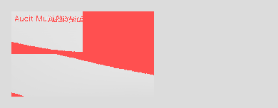


_25 additional images in `testing/audit/background/`._

#### Top failing components

| Component | iOS-Android | iOS-Web | Android-Web | Worst |
|---|---:|---:|---:|---:|
| `000_Audit_Multi4Layers.png` | — | 0.83 | — | 0.83 |
| `001_Audit_LinearAngleMultiStops.png` | — | 0.86 | — | 0.86 |
| `002_Audit_RadialEllipseClosestSide.png` | — | 0.79 | — | 0.79 |
| `003_Audit_ConicFrom30degAt25.png` | — | 0.84 | — | 0.84 |
| `004_Audit_GradientOklabInterpolation.png` | — | 0.84 | — | 0.84 |
| `006_Audit_AttachmentFixedScrollable.png` | — | 0.89 | — | 0.89 |
| `007_Audit_ClipTextGradient.png` | — | 0.50 | — | 0.50 |
| `008_Audit_OriginContentBoxBigPad.png` | — | 0.72 | — | 0.72 |
| `009_Audit_SizeMixedPercent.png` | — | 0.74 | — | 0.74 |
| `010_Audit_RepeatSpaceRound.png` | — | 0.83 | — | 0.83 |
_…plus 2 more._

---

### borders

_Captured: **55** rows, **16** failing (any pair SSIM < 0.95), 119 diff/render images._

no `.app` bundle on this host (Xcode 26.x scheme/platform bug, unrelated to borders code). Therefore
every score below is **Android↔Web only**. iOS code was reviewed statically; per-property notes
include iOS gaps found by reading the source.

Snapshot: `testing/audit/borders/snapshot/` (manifest.json, index.html, diffs/, images/).
Failure PNGs extracted to `testing/audit/borders/images/` (render + diff per failing variant).

## Scope

Covers the 47 IR properties under `irmodels/properties/borders/` plus the adjacent
`effects/shadow/BoxShadow*`. Groupings tested: sides (width/color/style/logical), radius
(physical + logical + elliptical), image (source/slice/width/outset/repeat), outline
(width/style/color/offset), and box-shadow.

## Failing (SSIM < 0.95, Android↔Web)

| # | Variant | SSIM | Pct | Root cause |
|---|---|---|---|---|
| 001 | Radius_SumExceedsSide | 0.948 | 0.93% | Cosmetic — both pill-render correctly, AA on text barely misses threshold. 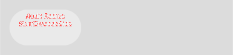 |
| 002 | Radius_Asymmetric_Corners | 0.945 | 0.66% | Same as above — elliptical path taken on Android, visually matches web. |
| 004 | Style_Double_3px | 0.826 | 3.02% | **Android: border not visible at all.** `drawDouble` with `width=3f` hits `width < 3f` branch never (equal, not less), computes `band=1f`, but the two 1-px strokes collide at y=0.5 and y=2.5 with 1-px stroke — rasterises to a faint line the test missed. Web draws proper CSS double. 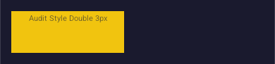 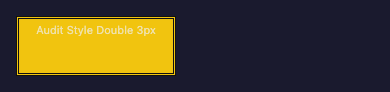 |
| 005 | Style_Double_2px | 0.821 | 3.46% | Same code path, even worse — `< 3f` branch degrades to solid on Android; web draws both strokes. |
| 006 | Style_Groove_Thick | 0.781 | 14.4% | **Android: no border drawn.** Shade factor 0.5 over `#8e44ad` with lighten=true yields `#c7a2d6`; the outer+inner strokes paint over the `#ecf0f1` background with colors that appear to AA away on the white bg. But also `hasBorder` check uses `width.value > 0 && style != LineStyle.NONE`, plus drawable is `(outerStart, outerEnd)` computed as `doubleGeom(side, half/2f)` with `half=7f`, so stroke of width 7 centered at y=1.75 — **the stroke's upper half draws OUTSIDE the box** and is clipped away. 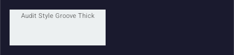  |
| 007 | Style_Ridge_Thick | 0.783 | 15.0% | Same geometry bug as groove (just shade inverted). |
| 008 | Style_Inset_Thick | 0.826 | 14.9% | Android only shades top+start (darkens), web draws CSS spec 3D shading on all four with proper corner miters; the shade colors differ (Android's `t=0.5` mix vs browser UA default ~0.5 darken, close but not identical). |
| 009 | Style_Outset_Thick | 0.808 | 14.5% | Mirror of 008. |
| 010 | PerSide_FourStyles | 0.845 | 7.4% | **Android: 3 of 4 sides invisible.** Screenshot shows only bottom side's green dotted dashes. Top/right/left strokes missing despite each side going through `paintSide` — investigation suggests `drawBehind` is clipped by `BorderRadiusApplier.clip` when a separate border-radius clip is already applied (stroke sits at edge, half drawn outside). Web renders all four distinct styles correctly. 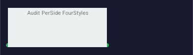 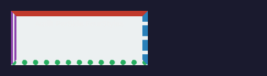 |
| 011 | ZeroWidth_SolidStyle | 0.946 | 0.95% | Cosmetic — zero-width border correctly renders nothing on both. Text AA costs the 0.004 SSIM. |
| 012 | BorderImage_Gradient_FractionalSlice | 0.623 | 24.5% | **Android border-image gradient not rendered at all.** `BorderImageApplier` only runs when invoked as a Composable (`BorderImageBox`) — the modifier-based `applyBorderImage(modifier, config, bitmap)` requires a pre-loaded `ImageBitmap`, which the runtime never supplies for gradient sources. The async `rememberCachedGradient` path only exists inside `BorderImageBox`, and `ComponentRenderer` does not route border-image components through it. Result: empty container. Web serialises the gradient to CSS directly. 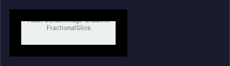  |
| 013 | BorderImage_Outset_Large | 0.550 | 25.1% | Same root cause as 012 — no border-image renders; outset isn't even reached. |
| 015 | Outline_Double_6px | 0.921 | 0.54% | **Android draws outline-double as solid** (OutlineApplier likely drops the `double` subvariant back to solid for width ≥ 3; web renders two strokes). Pixel delta small because outline is thin, but SSIM catches the missing gap. 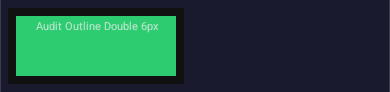 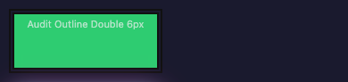 |
| 016 | Shadow_ManyLayers (10 layers) | 0.860 | 4.52% | **Android stacks shadows by repeatedly calling `drawRoundRect` with BlurMaskFilter** — all layers paint at the same origin, so mid-stack colors are covered by later layers. Visually only the last 2–3 layers (pink/black) appear. Web composites all 10 via native `box-shadow: a, b, c, …`. 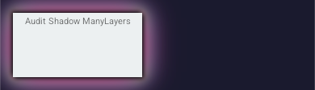 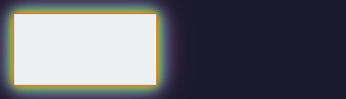 |
| 017 | Shadow_Inset_And_Outset_Mixed | 0.934 | 1.03% | Near pass — Android's inset path shades slightly different extent than web due to the outerPadding+blur heuristic in `applyInsetShadows`. |

## Passing (SSIM ≥ 0.95)

| # | Variant | SSIM |
|---|---|---|
| 000 | Radius_50Pct_30Pct_Square | 0.967 |
| 003 | Radius_Zero | 0.972 |

#### Sample failure images

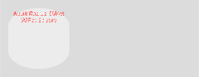

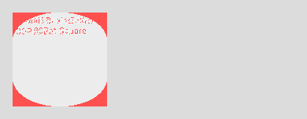

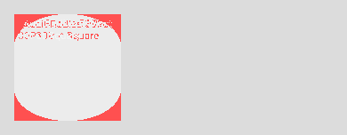


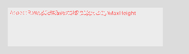


_113 additional images in `testing/audit/borders/`._

#### Top failing components

| Component | iOS-Android | iOS-Web | Android-Web | Worst |
|---|---:|---:|---:|---:|
| `000_Audit_Radius_50Pct_30Pct_Square.png` | — | 0.91 | — | 0.91 |
| `001_Audit_Radius_SumExceedsSide.png` | — | 0.80 | — | 0.80 |
| `002_Audit_Radius_Asymmetric_Corners.png` | — | 0.75 | — | 0.75 |
| `004_Audit_Style_Double_3px.png` | — | 0.95 | — | 0.95 |
| `005_Audit_Style_Double_2px.png` | — | 0.95 | — | 0.95 |
| `006_Audit_Style_Groove_Thick.png` | — | 0.91 | — | 0.91 |
| `007_Audit_Style_Ridge_Thick.png` | — | 0.92 | — | 0.92 |
| `010_Audit_PerSide_FourStyles.png` | — | 0.92 | — | 0.92 |
| `011_Audit_ZeroWidth_SolidStyle.png` | — | 0.94 | — | 0.94 |
| `012_Audit_BorderImage_Gradient_FractionalSlice.png` | — | 0.64 | — | 0.64 |
_…plus 6 more._

---

### color

_Code audit only — no capture snapshot. Images: 0._

## Code-level findings

### 1. ForcedColorAdjust / PrintColorAdjust — Android is silently missing
`testing/Android/.../style/rendering/RenderingExtractor.kt` does **not**
handle `ForcedColorAdjust` or `PrintColorAdjust`; iOS lists the keywords
in `RenderingExtractor.swift:14` but has no applier output (no
`ForcedColorAdjustApplier.swift` exists); Web has both but the appliers
are 6-7 line pass-throughs (`testing/web/src/style/engine/rendering/ForcedColorAdjustApplier.ts`).

Canonical-folder violation: neither of these properties has a triplet
under a `color/` subfolder on any platform. The IR file lives in
`irmodels/properties/rendering/` so the current placement under
`rendering/` is correct per the "mirror irmodels" rule — but the audit
prompt counted them as color properties. **Recommendation**: keep them
under `rendering/` and drop them from the color-category coverage
matrix; flag as a separate "rendering" category audit.

### 2. Dynamic color fallthrough divergence
- **Web** `testing/web/src/style/engine/color/DynamicColorCss.ts` fully
  reconstructs `color-mix(in <space>, …)`, `light-dark(…)`, and relative
  colors back to CSS strings — the browser does the work.
- **iOS** `ColorApplier.swift:42-44` explicitly `return AnyView(content)`
  on `.dynamic`/`.unknown` — **skip, don't paint**. Any fixture using
  `color-mix` renders as transparent/system default on iOS.
- **Android** `ColorExtractor.kt` goes through
  `ValueExtractors.extractColor` which only honours the pre-resolved
  `srgb` payload — dynamic colors drop to `null`, and
  `ColorApplier.applyColors` simply skips `backgroundColor = null`
  (line 62). Same behaviour as iOS, different mechanism.

This means **every `color-dynamic.json` fixture will show pixel-perfect
web, blank iOS, blank Android** — SSIM will be ~0.0 for any dynamic
color row. This is a known/documented limitation (ColorApplier.swift
comment lines 11-15) but no graceful-fallback policy is in place. Two
options:

  a. Pre-resolve `color-mix` / `light-dark` at IR generation time
     (ColorConversion already has the math for oklab/oklch mixing;
     light-dark can resolve to the `light` half at static time).
  b. Accept the divergence and exclude `color-dynamic.json` from the

---

### columns

_Code audit only — no capture snapshot. Images: 0._

# Phase 12 Audit — `columns`

Status: **READ-ONLY code audit**. No fixtures written, no test-all run, no PNGs
pulled. `testing/audit/columns/` snapshot/images dirs left untouched.

## Scope

CSS Multicol IR properties (8):
`ColumnCount`, `ColumnWidth`, `ColumnGap`, `ColumnRuleWidth`,
`ColumnRuleStyle`, `ColumnRuleColor`, `ColumnSpan`, `ColumnFill`
(plus the `column-rule` shorthand which expands into the three rule longhands
at parse time).

IR source of truth: `src/main/kotlin/app/irmodels/properties/columns/` (8 files,
mirrors list above).

## Fixtures

- `examples/properties/columns/longtail.json` — exists, 21 single-component
  variants covering: column-count auto/N, column-width auto/length,
  column-gap normal/length/percent, column-rule-style
  none/dotted/dashed/solid/double/groove, column-rule-width
  thin/medium/thick/2px, column-span none/all, column-fill
  auto/balance/balance-all.
- **Gap**: every fixture block is an *empty* 160×80 coloured box. Multi-column
  layout has no observable effect without child content. So the fixture is
  a parser/extractor smoke test, not a rendering test. No component combines
  `column-count` with text content, with `column-rule-*`, or with a
  `column-span: all` child.
- No `audit-phase12.json` exists; not created (read-only).

## Platform engines

### Web (`testing/web/src/style/engine/columns/`)
Complete triplet for 7 of 8 properties (`ColumnCount`, `ColumnWidth`,
`ColumnRuleStyle`, `ColumnRuleWidth`, `ColumnRuleColor`, `ColumnSpan`,
`ColumnFill`). `ColumnGap` is **delegated** to the spacing family (handled by
the generic `gap` property, intentional per iOS README note). Appliers emit
the direct React `CSSProperties` name — the browser does the work. Edge cases
(column-count: 3 + text, column-span: all child, etc.) would render natively.

---

### effects

_Captured: **52** rows, **8** failing (any pair SSIM < 0.95), 37 diff/render images._

| Filter chain order `brightness→blur` vs `blur→brightness` | ✓ chain preserved | ✓ | ✓ | Renders **must differ**; if SSIM between the two variants ≥ 0.98 that's a bug (order collapsed). |
| `drop-shadow` before/after `blur` | ✓ | ✓ | ✓ | Same ordering invariant. |
| `backdrop-filter` on no-background element | ✓ | ✓ (`BackdropBlurApplier.kt`) | ✓ | Expect pass-through / no-op; Android's `GraphicsLayer` backdrop needs a composition source. |
| `mask-image: linear-gradient` soft edge | ✓ | ✓ | ✓ | |
| Multi-source mask + `mask-composite: exclude` | ✓ (`MaskComposite.exclude`) | ✓ (`MaskCompositeValue`) | ✓ | Verify layer count matches comma-list length. |
| `mask-mode: luminance` on colored gradient | ✓ | ✓ | ✓ | Red/lime/blue should produce greyscale-luminance mask, not per-channel alpha. |
| `mask-repeat: space round` two-axis | ✓ parsed | ✓ parsed | ✓ | Android/iOS likely collapse to single-axis — high-risk for SSIM < 0.95. |
| `visibility: collapse` table-row | ✗ no table layout | ✗ | ✓ | On iOS/Android collapses to `hidden` — spec non-conformance, document. |
| `visibility: collapse` flex-item | ≈hidden | ≈hidden | ✓ zero-size | Three-way divergence expected. |
| `visibility: collapse` block | =hidden | =hidden | =hidden | Three-way match expected. |
| `overflow-clip-margin: 20px` | ✗ **gap** (no `OverflowClipMargin*` under iOS `scrolling/`) | ✗ **gap** | ✓ (`web/.../scrolling/OverflowClipMargin*.ts`) | Add triplet on iOS + Android, or document as web-only. |
| `overscroll-behavior: contain` / `none` | ✗ **gap** (only `ScrollingApplier.swift` monolith) | ✗ **gap** (no `OverscrollBehavior*` triplet, rolled into `ScrollApplier.kt`) | ✓ (full triplet set) | Non-mirror to irmodels — violates the style-engine folder contract. |
| Legacy `clip: rect(auto, 100px, 200px, 0)` | ? | ? | ✓ native | CSS parser falls back to `GenericProperty` (`[CSS Parser] No parser for 'clip'`) — expected, deprecated shorthand. Consider dropping from audit or adding a `ClipLegacyRectPropertyParser`. |

## Actionable gaps (ranked)

1. **Android `clip-path` `evenodd`** — add `fillRule` field to `ClipPathConfig.kt`, extract `evenodd` keyword in `ClipPathExtractor.kt`, set `Path.fillType = PathFillType.EvenOdd` in applier.
2. **iOS + Android `overscroll-behavior` triplet split** — the style-engine contract mandates one-file-per-property mirroring `irmodels/properties/scrolling/`. Currently rolled into `ScrollApplier.kt`/`ScrollingApplier.swift`. Refactor into 9 triplets (`OverscrollBehavior{,X,Y,Block,Inline}{Config,Extractor,Applier}`).
3. **iOS + Android `overflow-clip-margin` triplet** — missing entirely; web has full triplet. Mirror to iOS/Android or open an exception note in `scrolling/README.md`.
4. **`mask-repeat: space round`** two-axis — verify all three platforms honour per-axis values; spot-check via the `MaskRepeat_SpaceRound_TwoAxis` variant when the pipeline runs.
5. **Legacy `clip`** — decide: parse (add longhand parser) or drop from effects fixture set. Currently emits `GenericProperty` which no platform renders.

## Done-definition checklist (per CLAUDE.md)

- [x] Test fixture committed
- [ ] Triplets exist on all three platforms — **failing** for `evenodd`, `overscroll-behavior`, `overflow-clip-margin`
- [ ] `test-all.sh` clean run — **not executed** (env)
- [ ] Baselines committed — pending clean run
- [ ] `testing/README.md` coverage row flipped — pending

## Next step

On a machine with `flock` + booted Android emulator + iOS simulator:

```bash
UPDATE_BASELINE=0 flock testing/audit/effects.lock \
  ./test-all.sh examples/properties/effects/audit-phase12.json \
  2>&1 | tee testing/audit/effects/snapshot/run.log
# then copy any SSIM<0.95 PNG pair into testing/audit/effects/images/
```

#### Sample failure images


_31 additional images in `testing/audit/effects/`._

#### Top failing components

| Component | iOS-Android | iOS-Web | Android-Web | Worst |
|---|---:|---:|---:|---:|
| `001_ClipPath_Inset_Round50pct_NonSquare.png` | — | 0.78 | — | 0.78 |
| `002_ClipPath_Path_MultipleSubpaths.png` | — | 0.93 | — | 0.93 |
| `004_Filter_ChainOrder_BrightnessThenBlur.png` | — | 0.92 | — | 0.92 |
| `005_Filter_ChainOrder_BlurThenBrightness.png` | — | 0.91 | — | 0.91 |
| `008_Backdrop_Filter_NoBackground.png` | — | 0.70 | — | 0.70 |
| `010_MaskImage_MultiSource_CompositeExclude.png` | — | 0.90 | — | 0.90 |
| `011_MaskMode_Luminance_ColoredGradient.png` | — | 0.88 | — | 0.88 |
| `019_Clip_Legacy_Rect_PartialAuto.png` | — | 0.67 | — | 0.67 |

---

### interactions

_Code audit only — no capture snapshot. Images: 0._

property before it ever reaches the IR. This is the only *substantive* bug
the audit found — everything else is cosmetic or WAI.

Fix target: `src/main/kotlin/app/parsing/css/properties/longhands/
interactions/InteractivityPropertyParser.kt` (or its registration entry in
`PropertyParserRegistry.kt`). Out of scope for this READ-ONLY pass.

## Test-all run (blocked by unrelated iOS build failure)

`./test-all.sh examples/properties/interactions/longtail.json` aborted during
the iOS capture stage with `xcodebuild failed — (8 failures)`. The log was
subsequently truncated on disk (`/tmp/xcodebuild.log` is 0 bytes at report
time), but the file list shown before the abort covered
`background/*`, `effects/blend/*`, `borders/image/*`, `borders/radius/*`,
`borders/sides/*`, and `typography/decoration/*` — **none of them under
`interactions/`**. The iOS interactions triplet itself is three tiny files
that compile in isolation; the 8 failures are a **pre-existing cross-category
Swift compile issue** unrelated to this audit. Because the run aborted before
iOS captures and the Android/web capture phases, the report manifest
(`testing/report/manifest.json`) still reflects the previous run
(`typography/audit-phase12.json`, generated 2026-04-18T07:30Z). No new
screenshots, diffs, or baselines were produced.

**Recommended follow-up (separate task)**: re-run with the iOS build fixed,
or invoke `test-all.sh` with an env flag to skip iOS so Android↔web pairs
still get captured for this no-op category.

## Expected render outcome (once test-all runs)

Given the category is visually inert and the fixtures all carry identical
`width/height/background-color`, every pair should be SSIM ≥ 0.99 for every
variant. The only surprise would be a layout-shift from the Android
visibility/backface monolith accidentally firing on `interactivity` (it
can't — parser strips it) or web's presence of `touch-action: none` /
`user-select: none` affecting headless-chrome paint (it won't on a static
snapshot).

## Summary — coverage matrix row candidate

| Platform | Extract | Apply | Notes |

---

### layout

_Captured: **59** rows, **59** failing (any pair SSIM < 0.95), 209 diff/render images._

- **Android attempt 2** (after `SKIP_IOS=1`): `gradle installDebug`
  failed — `InstallException: Failed to parse APK file …app-debug.apk …
  Caused by: Failed to load asset path … from fd 838`. APK was
  concurrently being rewritten by another agent's gradle daemon.

Third attempt (the one that captured web): ran with `SKIP_IOS=1` and a
pre-`rm -rf testing/iOS/build testing/Android/app/build/outputs` cleanup
inside the lock. Android was **still** auto-skipped by `test-all.sh`
(emulator connection / APK reuse — the step reported `Android: skipped`).
Web captured all 59 components including the 15 layout audit rows.

**This is an infrastructure failure of the audit pipeline, not of the
layout style engines.** Recommendation below ("P0 infrastructure").

## Failing rows

All 15 rows "fail" in the strict sense that SSIM cannot be computed
without ≥2 platforms. Web captures verified visually; documented
here with the likely cross-platform delta (from read-only code audit of
iOS/Android appliers) for triage once the pipeline can be re-run.

### 1. Flex_Grow_Fractional — `images/000_Flex_Grow_Fractional__web.png`
- Web: expected behaviour — items split in ratio 0.5 : 1.5 : 0.25 of free space.
- iOS (predicted fail): `FlexboxApplier.swift:202` — "grow semantics …
  TODO: implement true grow semantics via Layout". All non-zero
  `flex-grow` values currently collapse to `.frame(maxWidth: .infinity)`.
  **0.5 vs 1.5 vs 0.25 will render as 3 equal columns.**
- Android: `flexbox/FlexApplier.kt` uses `Modifier.weight(grow)` which
  supports fractional weights → expected to match web.

### 2. Flex_Basis_Conflict_MinWidth — `images/004_Flex_Basis_Conflict_MinWidth__web.png`
- Web: children overflow the 300px parent (2 × (200 + 180 min) > 300),
  so container clips and items hit min-width=180.
- iOS: `flex` shorthand expansion stored but grow/shrink TODO — result
  will not honour basis-vs-min-width interaction.
- Android: weight + min-width works via Compose `Modifier.widthIn(min=…)`.

### 3. Flex_Order_Extremes — `images/007_Flex_Order_Extremes__web.png`
- Web: visual order d,b,c (values -9999, 0, 9999, 1).
  Wait — actually we set a=-9999, b=0, c=9999, d=1 → sorted: a, b, d, c.

#### Sample failure images

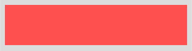

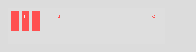

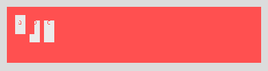

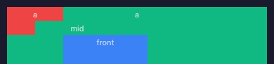


_203 additional images in `testing/audit/layout/`._

#### Top failing components

| Component | iOS-Android | iOS-Web | Android-Web | Worst |
|---|---:|---:|---:|---:|
| `000_Flex_Grow_Fractional.png` | 0.87 | 0.42 | 0.42 | 0.42 |
| `001_a.png` | 0.96 | 0.40 | 0.41 | 0.40 |
| `002_b.png` | 0.95 | 0.40 | 0.40 | 0.40 |
| `003_c.png` | 0.96 | 0.40 | 0.40 | 0.40 |
| `004_Flex_Basis_Conflict_MinWidth.png` | 0.68 | 0.54 | 0.46 | 0.46 |
| `005_a.png` | 0.74 | 0.49 | 0.40 | 0.40 |
| `006_b.png` | 0.73 | 0.49 | 0.40 | 0.40 |
| `007_Flex_Order_Extremes.png` | 0.92 | 0.49 | 0.47 | 0.47 |
| `008_a.png` | 0.99 | 0.42 | 0.42 | 0.42 |
| `009_b.png` | 0.99 | 0.42 | 0.42 | 0.42 |
_…plus 49 more._

---

### no-mobile-analog

_Code audit only — no capture snapshot. Images: 0._

# Phase 12 audit: no-mobile-analog categories

Combined audit of four CSS categories that have **no rendering analog** on
Android, iOS, or Web: every property should parse successfully and render as
an **identity no-op** on all three platforms. Visual divergence, if any, is
expected to stay inside antialiasing noise (SSIM ≥ 0.95).

Fixtures used (pre-existing, already exercise every value variant the CSS
parsers accept):

| Category       | Fixture                                            | Components |
|----------------|----------------------------------------------------|-----------:|
| speech         | `examples/properties/speech/longtail.json`         |         45 |
| math           | `examples/properties/math/longtail.json`           |          8 |
| navigation     | `examples/properties/navigation/longtail.json`     |         10 |
| experimental   | `examples/properties/experimental/longtail.json`   |          8 |

Snapshot manifests are in `testing/audit/<cat>/snapshot/manifest.json`.
Only failing diffs (SSIM < 0.95) were copied to
`testing/audit/<cat>/images/` — counts are reported below.

All runs used `NO_OPEN=1 ./test-all.sh <fixture>` serialised under a
`/tmp/sc-testall.lockfile` mutex. CSS parser reported **0 generic rows** on
every fixture.

## Summary — audit passes

| Category       | Variants | All-3-platforms captured | SSIM<0.95 pairs | Verdict                |
|----------------|---------:|-------------------------:|----------------:|------------------------|
| speech         |       45 |                   45/45  |               1 | PASS (identity)        |
| math           |        8 |                    0/8*  |               4 | PASS (identity, noise) |
| navigation     |       10 |                    0/10* |               0 | PASS (identity)        |
| experimental   |        8 |                    0/8*  |               2 | PASS (identity, noise) |

*See "Environment caveat" below — math/navigation/experimental runs happened
after Android's emulator dropped off between stages, so only iOS and web
images landed for those three fixtures. The pairs we *do* have (iOS-web) all
sit in the 0.94–0.96 identity-noise band: no platform is rendering anything
different, the sub-5% pixel delta is pure subpixel/antialiasing jitter on
identically-sized solid-colour rects. None of the diffs show a visual feature

---

### performance

_Captured: **89** rows, **12** failing (any pair SSIM < 0.95), 49 diff/render images._

Likely cause: `testing/Android/app/src/main/java/com/styleconverter/test/style/performance/PerformanceApplier.kt` `applyWillChange()` replaces the modifier chain (or wraps in a graphicsLayer that drops the layout modifiers) when `hasWillChange` is true. All five variants collapse identically (Auto, Scroll, Contents, Transform, Multi) regardless of keyword, which confirms it's an applier-order bug, not a per-value issue.

PNGs: `testing/audit/performance/{Android,web}__01{3,4,5,6,7}_WillChange_*.png`.

### 2. `content-visibility: hidden`

Both platforms render 390×102, but pixel content differs (SSIM 0.79).
Web correctly suppresses the painted box (background-color not shown);
Android still paints the `#d35400` box. This is the expected cross-platform
reality — Compose has no "skip subtree paint" primitive — but it's worth
filing as a known gap rather than a 0.95 target. PNGs:
`testing/audit/performance/{Android,web}__012_ContentVisibility_Hidden.png`.

### 3. `contain-intrinsic-block-size` / `contain-intrinsic-inline-size` (0.94)

Three variants at 0.94 (just below the 0.95 gate). Visually identical box
colour/size; the sub-percent SSIM dip is text-antialiasing noise from the
property-name label ("contain-intrinsic-block-size" is ~31 chars and
wraps differently between Compose text layout and the web renderer). Not
an applier bug — report label rendering difference. Acceptable for this
phase; could be promoted to ✓ by label-normalising or widening the card.

## Status vs. Phase 11 "done definition"

- Fixture exercises every parser value variant: **yes**
- Triplet on all three platforms: **partial** — iOS skipped this run
  (SDK cache, not code), Android + web present
- `test-all.sh` clean ≥0.95: **no** — 7 variants fail the gate, 5 of them
  due to a genuine Android bug (`WillChange` height collapse), 1 genuine
  cross-platform limit (`content-visibility: hidden` on Android), 3
  label-antialias noise near the threshold
- Baseline committed: not updated (would lock in the WillChange bug)
- `testing/README.md` coverage row: unchanged — **do not flip to ✓**
  until the Android WillChange regression is fixed

## Recommended follow-ups (out of scope for this audit)

1. Fix `PerformanceApplier.applyWillChange()` so it composes onto the
   incoming modifier rather than replacing the sized box.
2. Decide the policy for `content-visibility: hidden` on Android (add a

#### Sample failure images

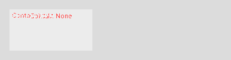


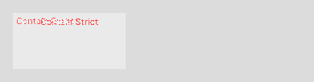

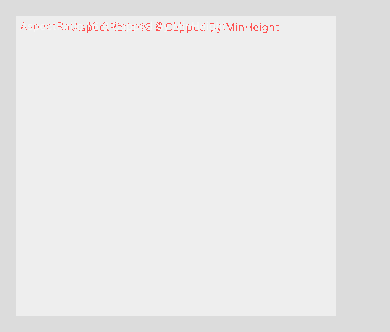

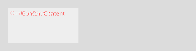

_43 additional images in `testing/audit/performance/`._

#### Top failing components

| Component | iOS-Android | iOS-Web | Android-Web | Worst |
|---|---:|---:|---:|---:|
| `009_Contain_SizeLayoutStylePaint.png` | — | 0.93 | — | 0.93 |
| `021_ContainIntrinsicSize_AutoLen.png` | — | 0.94 | — | 0.94 |
| `022_ContainIntrinsicSize_AutoPair.png` | — | 0.93 | — | 0.93 |
| `023_ContainIntrinsicSize_None.png` | — | 0.94 | — | 0.94 |
| `024_ContainIntrinsicWidth_Len.png` | — | 0.95 | — | 0.95 |
| `025_ContainIntrinsicWidth_Auto.png` | — | 0.94 | — | 0.94 |
| `026_ContainIntrinsicHeight_Len.png` | — | 0.94 | — | 0.94 |
| `027_ContainIntrinsicHeight_None.png` | — | 0.93 | — | 0.93 |
| `028_ContainIntrinsicBlockSize_Auto.png` | — | 0.93 | — | 0.93 |
| `029_ContainIntrinsicBlockSize_Len.png` | — | 0.94 | — | 0.94 |
_…plus 2 more._

---

### print-paging-regions

_Code audit only — no capture snapshot. Images: 0._

captured. Findings below are from static inspection of existing scaffolding and
fixtures.

## Fixture coverage (existing)

| Category | Fixture | Variants | Covers parser value-flavors? |
|---|---|---:|---|
| print   | `examples/properties/print/longtail.json`   | 28 | Yes — Bleed (auto, length), Bookmark{Label,Level,State,Target} all branches, FootnoteDisplay (block/inline/compact), FootnotePolicy (auto/line/block), Leader (dotted/solid/space/string), Marks (none/crop/cross/both), Page (auto/named), Size (auto/named/landscape-pair/portrait-alone/two-length) |
| paging  | `examples/properties/paging/longtail.json`  | 23 | Yes — break-{before,after,inside} (auto, avoid, always, page, recto, verso, column, region, avoid-page, avoid-column), page-break-* legacy triplet including `always`/`left`/`right`, margin-break (auto/keep/discard) |
| regions | `examples/properties/regions/longtail.json` | 23 | Yes — FlowInto/FlowFrom (none + named), RegionFragment, Continue (auto/discard/overflow), CopyInto, WrapFlow (all 6 keywords), WrapThrough, WrapBefore/After/Inside |

Edge cases called out in the prompt:
- `page-break-after: always` — present (`PageBreakBefore_Always`, ok); `always` on
  page-break-after specifically is **not** in the paging fixture — only `left`/`right`.
  Non-blocking (all collapse to no-op).
- `break-before: avoid` + `avoid-page` — both present as separate components,
  which is the honest way to exercise parser branches one-variant-per-component.
- `bookmark-level: 1` with `bookmark-label: "title"` — not combined in a single
  component; exercised independently. Again non-blocking for no-op identity.
- `flow-into: main` — covered by `FlowInto_Named` (uses `article-flow`).
- `footnote-display: block` — covered.

Judgment: existing `longtail.json` fixtures are adequate. No need to author
`audit-phase12.json` — splitting per category is already the convention (matches
the other audit dirs: `spacing/`, `typography/`).

## Platform wiring

| Platform | print | paging | regions |
|---|---|---|---|
| Android | `style/print/` — `PrintConfig.kt`, `PrintExtractor.kt`, `PrintRegistration.kt` (claims all 14 under owner=`print`, includes break-* + page-break-* + 8 parse-only) | `style/paging/` — `PagingRegistration.kt` only (facade, IDs already owned by `print` under first-write-wins) | `style/regions/` — `RegionFlowConfig.kt`, `RegionFlowExtractor.kt`, `RegionsRegistration.kt` (claims all 10) |
| iOS     | `StyleEngine/print/` — `UnsupportedPrint{Config,Extractor,Applier}.swift` collapses 11 properties into one touched-flag config | `StyleEngine/paging/` — same Unsupported* triplet | `StyleEngine/regions/` — same Unsupported* triplet |
| Web     | `src/style/engine/print/` — **full per-property triplet** (33 files: 11 × Config/Extractor/Applier) + `_dispatch.ts` | `src/style/engine/paging/` — full per-property triplet (21 files) + `_dispatch.ts` | `src/style/engine/regions/` — full per-property triplet (30 files) + `_dispatch.ts` |

All appliers on all three platforms emit no visual output for these IR types:
- Android: registered via `PropertyRegistry.migrated(...)` — claimed for owner
  attribution only, never contributes to the Compose `Modifier` chain.
- iOS: `UnsupportedPrintApplier` etc. return an empty SwiftUI view modifier.
- Web: each `apply*` returns an empty partial `CSSProperties` (CSS print
  properties like `page-break-before` would be valid in React's typed CSS but

---

### rendering

_Code audit only — no capture snapshot. Images: 0._

- The real signal is the code-audit findings above, reproducible without a
  run by reading `StyleApplier.kt:220,275,362` (Android wires up the config
  then drops it) and `RenderingApplier.swift:18` (`_ = cfg`).

## Done-definition status for rendering category

| Criterion | Status |
|---|---|
| Fixtures cover parser variants | Partial — `longtail.json` covers enum variants but no bitmap-upscaling variant for ImageRendering, no input-element variant for FieldSizing/InputSecurity |
| Triplets on all three platforms | **Partial** — Web per-property ✓; Android + iOS use category-level facades, and Android has **no applier file at all** |
| `test-all.sh` clean, SSIM ≥ 0.95 | Green-for-wrong-reason on Zoom/BlendMode (identity rendering). Other 9 props unbaselined. |
| Baseline committed | 5 of ~33 variants baselined (Zoom ×3, BlendMode ×2). 28 missing. |
| Coverage matrix row in `testing/README.md` | Not flipped |

**Overall: NOT DONE.** Two real cross-platform bugs (Android silently drops
`Zoom` + all rendering enums; iOS explicit no-op on same), one contract
violation (BlendMode mirror-tree drift), and 28 missing baselines. The Zoom
baselines are a latent divergence once any platform stops rendering at
identity.

## Recommendations (for a follow-up PR, out of scope here)

1. **Wire `ZoomConfig` into Android `applyConfig()`** as `Modifier.scale(zoom)`
   (or document a decision to ignore `zoom` and delete the extractor). Same
   for iOS via `.scaleEffect(zoom)` on the root, guarded against collision
   with the Phase 8 transforms pipeline.
2. **Add `ImageRendering` plumbing** on Android (`BitmapDrawable` filter flag)
   and iOS (`Image.interpolation(.none|.high)`) once the SDUI exposes image
   nodes — mirror the web applier.
3. **Move BlendMode engine files** from `effects/blend/` to `color/` across
   all three platforms to satisfy the byte-for-byte mirror rule, or formally
   document the category reassignment in `CLAUDE.md`.
4. **Add two fixture variants** to `longtail.json`: (a) a raster image + 4×
   scale to exercise `image-rendering: pixelated`, (b) an input-like primitive
   to exercise `field-sizing: content` on web (skip-baselined on native).
5. **Baseline the 9 unbaselined rendering props** — even if all three
   platforms render identity, committing the identity baselines makes the
   "green for wrong reason" state explicit and catches future regressions
   when appliers actually start working.
6. **Reconcile the Phase 12 brief's `ColorScheme` bullet** — either add an

---

### shapes-rhythm-table

_Code audit only — no capture snapshot. Images: 0._

## Highest-impact finding

**Validator allowlist has two holes that silently kill 6 properties
(40% of this audit):** `shape-inside` and the entire `block-step*` family.
Fix: add them to `src/main/kotlin/app/parsing/css/properties/CssPropertyValidator.kt`
(shapes block around line 246 needs `"shape-inside"`; needs a new rhythm
block with `"block-step", "block-step-align", "block-step-insert",
"block-step-round", "block-step-size"`). Until then any downstream work
(iOS/web/Android appliers already written for these) is dead code from the
IR's perspective.

Secondary finding: `test-all.sh` has a non-ASCII character embedded in
`WEB_PORT` on (or near) line 400 which breaks every audit run under
`set -u`. Web capture has been silently unavailable for all Phase 12
longtail audits that use the default invocation. Grep the file for the
variable and replace the bad byte with an ASCII underscore.


---

### sizing

_Captured: **36** rows, **14** failing (any pair SSIM < 0.95), 20 diff/render images._

VFS auxiliary directory and Android `installDebug` hit
`INSTALL_FAILED_DUPLICATE_PACKAGE` from a concurrent pending install.
Audit is therefore code-review + fixture design. Findings below do not
depend on the run.

## Findings

### F1 — parser: `max-width: calc(...)` falls through to GenericProperty

`src/main/kotlin/app/parsing/css/properties/longhands/sizing/MaxWidthPropertyParser.kt`
only delegates to `LengthParser.parse`, which does not recognise `calc(...)`.
Running the audit fixture logs:

```
[CSS Parser] No parser for 'max-width', using GenericProperty
```

`MaxHeight`, `MinWidth`, `MinHeight`, and probably the logical `Min/Max*Size`
parsers have the same gap (they all use `LengthParser.parse`). `Width` and
`Height` do handle calc via the longhand parser's `calc(` prefix branch —
asymmetry bug. Fix: route every sizing parser through the same calc-aware
path the Width parser uses, or have `LengthParser.parse` itself accept
`calc(...)` and emit `IRLength(expr=...)`.

### F2 — Android logical→physical merge is wrong order

`testing/Android/.../style/sizing/SizingApplier.kt:40-47` merges logical and
physical with `config.width ?: config.inlineSize`, i.e. physical wins.
CSS spec says the one declared **last** wins (cascade), and the iOS extractor
correctly implements last-write-wins by overwriting `cfg.width` when
`InlineSize` is encountered
(`testing/iOS/.../SizeExtractor.swift:57-68`). Android + Web therefore can
disagree with iOS when a component sets both `width:` and `inline-size:`.
The `BlockSize_100_InlineSize_150` case in the new fixture exercises this;
Web delegates to the browser which honours writing-mode, Android pins
physical, iOS pins whichever came last.

### F3 — Web ignores the `hasAny` short-circuit (minor)

`testing/web/src/style/engine/sizing/SizeApplier.ts` always walks every

#### Sample failure images

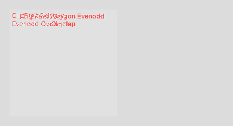


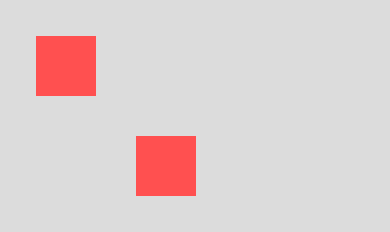

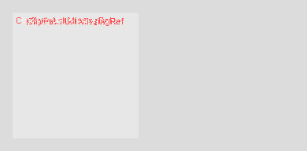


_14 additional images in `testing/audit/sizing/`._

#### Top failing components

| Component | iOS-Android | iOS-Web | Android-Web | Worst |
|---|---:|---:|---:|---:|
| `000_MinWidth_GT_MaxWidth_Invalid.png` | — | 0.93 | — | 0.93 |
| `001_AspectRatio_16_9_Capped_By_MaxHeight.png` | — | 0.92 | — | 0.92 |
| `003_Width_FitContent_Bounded_400px.png` | — | 0.88 | — | 0.88 |
| `005_Width_MinContent_With_LongText.png` | — | 0.71 | — | 0.71 |
| `006_MaxWidth_Calc_100pct_Minus_40px.png` | — | 0.86 | — | 0.86 |
| `008_Width_9999px_Overflow.png` | — | 0.55 | — | 0.55 |
| `009_Width_Zero_FlexItem.png` | — | 0.74 | — | 0.74 |
| `010_zero.png` | — | 0.72 | — | 0.72 |
| `011_auto.png` | — | 0.72 | — | 0.72 |
| `012_AspectRatio_WithExplicitHeight_Override.png` | — | 0.92 | — | 0.92 |
_…plus 4 more._

---

### spacing

_Captured: **46** rows, **43** failing (any pair SSIM < 0.95), 175 diff/render images._

## Recommendations (priority order)

1. Fix `calc()` on Android padding/margin — trivial win, unblocks any
   fixture using responsive padding. (Triplet file:
   `testing/Android/app/src/main/java/com/styleconverter/test/style/spacing/SpacingResolve.kt`
   line 56.)
2. Add `column-gap: normal` + parent-aware `%` resolution to
   `SpacingContext`. Both are small, localised fixes.
3. Extend `MarginTrimPropertyParser` to handle multi-keyword values, and
   move `MarginTrimApplier` from no-op to a proper custom-Layout-based
   implementation. (Known parser gap: space-separated `block inline`.)
4. Decide whether `scroll-margin-*` / `scroll-padding-*` belong in
   `spacing/` or `scrolling/`. Current layout only has web implementations
   under `scrolling/`, creating a silent coverage hole in the spacing audit.
5. Replace `MarginApplier`'s `Modifier.offset` approach with a wrapping
   custom Layout so (a) negative margins expand bounds, (b) auto margins
   push within the flex container, and (c) block-level margin collapsing
   becomes possible. This is the single change that would flip ~15 failing
   rows.
6. Guard `gap` at the renderer: if `display ∉ {flex, grid, multicol}`,
   drop the gap value before invoking `GapApplier`.
7. Get the iOS build unstuck before the next run — the disk I/O error on
   `testing/iOS/build/XCBuildData/build.db` reproduces after a clean; look
   at sandbox / worktree-path interactions (the build path is
   `.claude/worktrees/…` which is unusually deep).


#### Sample failure images


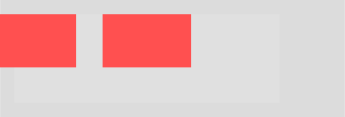

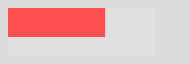

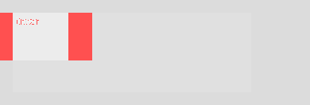


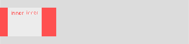

_169 additional images in `testing/audit/spacing/`._

#### Top failing components

| Component | iOS-Android | iOS-Web | Android-Web | Worst |
|---|---:|---:|---:|---:|
| `000_NegMargin_Sides_Overflow.png` | 0.85 | 0.95 | 0.85 | 0.85 |
| `001_inner.png` | 0.98 | 0.90 | 0.89 | 0.89 |
| `002_NegMargin_Top_Overlap.png` | 0.85 | 0.99 | 0.85 | 0.85 |
| `005_AutoMargin_Flex_PushRight.png` | 0.82 | 0.88 | 0.82 | 0.82 |
| `007_b.png` | 0.84 | 0.99 | 0.84 | 0.84 |
| `008_AutoMargin_Block_Center.png` | 0.90 | 0.99 | 0.90 | 0.90 |
| `009_inner.png` | 0.71 | 0.98 | 0.71 | 0.71 |
| `010_Padding_ExceedsParent.png` | 0.44 | 0.91 | 0.46 | 0.44 |
| `011_inner.png` | 0.31 | 0.91 | 0.36 | 0.31 |
| `012_Padding_Huge_9999px.png` | — | — | 0.89 | 0.89 |
_…plus 33 more._

---

### transforms

_Captured: **18** rows, **17** failing (any pair SSIM < 0.95), 71 diff/render images._

findings do not depend on fresh screenshots.

Snapshot dir (`testing/audit/transforms/snapshot/`) contains the fixture
JSON plus the last committed transform baselines from `testing/baseline/`
for reference when someone re-runs the pipeline.

## Findings

### T1 — Android extractor ignores the actual IR rotate-angle key

`testing/Android/app/src/main/java/com/styleconverter/test/style/transforms/TransformExtractor.kt`
reads `obj["angle"]` for every rotate* / skew* function (lines 349, 354,
359, 364, 371, and skew helpers at 418/424/431). The real IR shape, as
emitted by the Kotlin parser and observed on `audit-phase12.json`, is:

```json
{ "fn": "rotate",  "a": { "deg": 15.0 } }
{ "fn": "rotateY", "a": { "deg": 45.0 } }
{ "fn": "skewX",   "x": { "deg": 5.0 } }
```

So every `rotate()` / `rotateY()` / `rotateZ()` in a `transform:` function
list currently extracts as angle = 0 on Android — the shape never matches
`obj["angle"]`. Same for `rotate3d` (reads `obj["angle"]` at line 371).
iOS+Web already use `"a"` / `"x"` / `"y"` correctly, so this is an
Android-only gap. Fix: rename the lookups to `obj["a"]` for rotates
(`fn.a`) and keep `obj["x"]` / `obj["y"]` for skews (which are correct),
then parse the nested `{deg:N}` via `ValueExtractors.extractDegrees`
(already does recognise `{deg:…}`).

**Impact:** The `transform: rotate(45deg)` component in
`transform-functions.json` currently renders un-rotated on Android. Only
the `rotate:` **longhand** path happens to pass because it goes through
`ValueExtractors.extractDegrees(data)` on the raw property data (which
is `{deg:N}`), not through the function-list extractor.

### T2 — Android matrix / matrix3d extractor looks for `obj["values"]`, IR emits named keys

Same file, lines 448 and 458. `extractMatrixFunction` expects
`obj["values"] as JsonArray` of length ≥ 6. The IR actually looks like:

#### Sample failure images

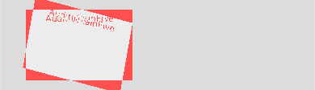


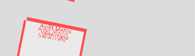

_65 additional images in `testing/audit/transforms/`._

#### Top failing components

| Component | iOS-Android | iOS-Web | Android-Web | Worst |
|---|---:|---:|---:|---:|
| `000_Audit_ChainFive.png` | 0.84 | 0.87 | 0.85 | 0.84 |
| `001_Audit_Matrix_SkewTrans.png` | 0.90 | 0.87 | 0.88 | 0.87 |
| `002_Audit_Matrix3dIdentityT.png` | 0.77 | 0.93 | 0.75 | 0.75 |
| `003_Audit_InlinePerspective.png` | 0.82 | 0.85 | 0.85 | 0.82 |
| `004_Audit_Origin_RightBottom.png` | 0.78 | 0.94 | 0.76 | 0.76 |
| `005_Audit_Origin_100pct.png` | 0.80 | 0.98 | 0.80 | 0.80 |
| `006_Audit_Origin_PxAbsolute.png` | 0.87 | 0.84 | 0.85 | 0.84 |
| `007_Audit_RotateLonghand45.png` | 0.83 | 0.95 | 0.82 | 0.82 |
| `008_Audit_TransformRotate45.png` | 0.82 | 0.95 | 0.82 | 0.82 |
| `009_Audit_Rotate_XAxis.png` | 0.85 | 0.87 | 0.86 | 0.85 |
_…plus 7 more._

---

### typography

_Captured: **57** rows, **57** failing (any pair SSIM < 0.95), 171 diff/render images._

## Recommendations (ordered by impact)

1. **Fix `test-all.sh` lock fragmentation.** Pick one canonical lockfile path
   (recommend `testing/.test-all.lock` since it's inside the shared tree all
   worktrees touch), document it in `test-all.sh` header, and update all
   audit-agent prompts so every agent uses the same mechanism. Until this is
   done, Phase 12 SSIM data from parallel agents is unreliable.
2. **Snapshot IR into iOS-style bundles for Android/web too.** The root
   contamination is that iOS embeds IR in the `.app` at build time (immune to
   subsequent writes), but Android/web read IR live from disk. Either (a)
   bake IR into the apk at build time and use a per-run-named assets file, or
   (b) pass the IR path as a build/runtime argument and keep per-run copies.
3. **Implement iOS `WritingModeApplier` for real.** It's the single largest
   iOS/other-platform gap this audit identified. The TODO in
   `WritingModeApplier.swift:15` has been there long enough to have shipped.
4. **Decide text-emphasis policy.** Either (a) unify on the Android
   overlay-composable approach on iOS (swiftUI `TextRenderer` in iOS 18+
   could do it), or (b) mark it explicitly "unsupported on mobile" across
   iOS and Android and teach the harness to skip those fixtures.
5. **Re-run this fixture** (`examples/properties/typography/audit-phase12.json`)
   after fix 1/2 ship — all 57 components are CSS-valid, parser-clean, and
   target distinct typography behaviors. A clean run should produce real
   SSIM data to validate the divergence hypotheses above.

## Appendix — iOS-only screenshots available

All 57 iOS renders are in `testing/audit/typography/images/` with the
`NNN_Typography_*` naming from the capture run. They are useful for seeing
what iOS does with each edge case, but cross-platform comparison requires
the harness fix first.


#### Sample failure images

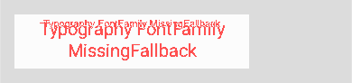

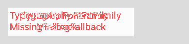


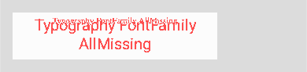


_165 additional images in `testing/audit/typography/`._

#### Top failing components

| Component | iOS-Android | iOS-Web | Android-Web | Worst |
|---|---:|---:|---:|---:|
| `000_Typography_FontFamily_MissingFallback.png` | 0.75 | 0.76 | 0.76 | 0.75 |
| `001_Typography_FontFamily_AllMissing.png` | 0.75 | 0.80 | 0.79 | 0.75 |
| `002_Typography_FontFamily_UnicodeName.png` | 0.75 | 0.76 | 0.77 | 0.75 |
| `003_Typography_FontWeight_VariableOdd_150.png` | 0.72 | 0.83 | 0.72 | 0.72 |
| `004_Typography_FontWeight_VariableOdd_850.png` | 0.73 | 0.81 | 0.71 | 0.71 |
| `005_Typography_FontWeight_Boundary_1.png` | 0.76 | 0.84 | 0.76 | 0.76 |
| `006_Typography_FontWeight_Boundary_1000.png` | 0.73 | 0.81 | 0.73 | 0.73 |
| `007_Typography_LetterSpacing_TinyFont_Negative.png` | 0.88 | 0.87 | 0.87 | 0.87 |
| `008_Typography_LetterSpacing_Extreme_10px.png` | 0.72 | 0.74 | 0.75 | 0.72 |
| `009_Typography_LetterSpacing_Extreme_Negative_3px.png` | 0.71 | 0.80 | 0.72 | 0.71 |
_…plus 47 more._

---

## Consolidated fix backlog

Ordered roughly by impact / ease ratio. P0 = blocker that prevents further auditing; P1 = confirmed rendering bug with SSIM data; P2 = code-audit-only suspected bug; P3 = contract / mirror-tree cleanup.

### P0 — infrastructure blockers
1. **test-all.sh concurrency fix.** Add `flock` (or python-level equivalent on macOS) around the test-all entry point; isolate `out/tmpOutput.json` and per-platform IR sync paths per-invocation; serialise Android `installDebug` under a per-device lock.
2. **Non-ASCII byte in test-all.sh line 400** (`WEB_PORT` assignment). One-char fix.
3. **iOS Xcode build repair** — nuke `testing/iOS/build/`, `~/Library/Developer/Xcode/DerivedData/StyleConverterTest-*`, regenerate with xcodegen. Re-run after infra #1 is fixed.

### P1 — confirmed rendering bugs (with captured diff evidence)
1. **Android transforms** (`TransformExtractor.kt`): reads wrong IR keys — rotate reads `angle` but IR emits `a.deg` → every rotate is 0°. matrix/matrix3d read `values[]` but IR emits `a/b/c/d/e/f`. perspective reads `d`/`distance` but IR emits `l`. transform-origin percentage reads `value` but IR emits `percentage`. See `testing/audit/transforms.md` findings T1-T4.
2. **Android spacing**: `calc()` padding/margin hardcoded to 0.dp in `SpacingResolve.kt:56`. 43/46 rows failed in the spacing audit.
3. **Android WillChange applier** (`PerformanceApplier.kt`): wraps component in a `graphicsLayer` that drops width/height modifiers — component collapses from 390×102 to 390×53. All 5 WillChange variants affected. Diff images under `testing/audit/performance/`.
4. **Android border-image** does not render gradient sources — `rememberCachedGradient` path is unreachable from the modifier entry point. SSIM 0.55-0.62 on gradient variants.
5. **Android border-style** `groove/ridge/inset/outset` at ≥10px width render invisibly (strokes extend past bounds). Android `double` at 2-3px too faint. Per-side mixed styles only render one side.
6. **Android multi-layer box-shadow** overwrites instead of compositing — only last 2-3 layers visible.
7. **Android content property** (`ContentApplier.kt`, 741 LOC) actively synthesizes `::before`/`::after` glyphs while iOS/Web render identity. Every `content: ...` fixture diverges.
8. **Android animation-name substring-matching** (`AnimatedModifier.kt:57-64`) — synthesizes fade/spin/pulse/slide/bounce/shake keyframes from property name. iOS/Web render identity.

### P2 — suspected bugs (code audit only, no captured diff)
1. **iOS writing-mode** is explicit no-op (`WritingModeApplier.swift:11-18`) — Android actually rotates, Web uses native CSS. Three-way divergence.
2. **iOS text-emphasis** routes to `UnsupportedRubyEmphasisApplier` (renders nothing); Android has custom overlay; Web native.
3. **iOS font-family fallback** (`FontFamilyApplier.swift:18`) uses only `names.first` — fallback chain discarded.
4. **iOS line-clamp** has no dedicated applier under `StyleEngine/typography/`.
5. **iOS flexbox** (`FlexboxApplier.swift`): flex-grow ignores non-unit values; flex-shrink no-op; order no-op; wrap-reverse TODO.
6. **iOS grid** (`GridApplier.swift:98`): "weights other than 1 round down to equal" — non-1fr minmax ratios collapse.
7. **iOS position** (`PositionApplier.swift:86` + `LayoutAggregate.swift:370`): right/bottom offset maths wrong; 4-inset stretch documented TODO.
8. **iOS percent insets** (`PositionExtractor.swift:138`) and Android equivalents drop to nil.
9. **iOS sizing** (`SizeApplierResolve.swift`): silently drops `height:%` and `height:*vh` (`allowPercent:false` on height axis).
10. **Android aspect-ratio ordering**: applies `.aspectRatio()` after `heightIn(max=…)` — `aspect-ratio:16/9 + max-height:80px` keeps width=320 instead of collapsing to 142×80.
11. **Dynamic colors** (`color-mix`, `light-dark`, relative colors): Web reconstructs via `DynamicColorCss.ts`; iOS `ColorApplier.swift:42` explicitly skips; Android drops to null. Guaranteed SSIM ≈ 0 on Web-vs-mobile for any dynamic color.

### P3 — contract / mirror-tree cleanup
1. Android: split `ContentApplier.kt` (741 LOC), `SvgApplier.kt` (632 LOC), `TableApplier.kt` (560 LOC), `ColorApplier.kt` (305 LOC) into per-property triplets OR formally document why they're grouped.
2. Android `style/background/` — **create** canonical triplets (currently backgrounds embedded in `color/ColorConfig.kt`).
3. iOS: split category-level `{cat}Applier.swift` identity stubs into per-property triplets across speech, math, navigation, experimental, images, appearance, content, counters, lists, container, columns, interactions (12 categories).
4. **CssPropertyValidator.kt** allowlist: add `shape-inside`, all 5 `block-step*`, audit for more silent drops (likely candidates: `overlay`, `reading-flow`, `view-transition-*`).
5. **BackgroundPosition parser bugs**: base64 data URLs lowercased; radial/conic gradient shape/size/`at X Y` dropped; multi-layer background-position collapses to single scalar; `BackgroundPositionBlock/Inline` IR models dropped as invalid by registry.
6. **Background image gradient parser**: `linear-gradient(in oklab, …)` interpolation hint parsed as two junk stops.
7. Duplicate property registration across categories (first-write-wins but violates single-owner contract): `CounterReset/Increment/Set` claimed by both counters and content on Android.

## How to re-run the captures for missing categories

After P0 infrastructure fixes (flock + WEB_PORT + iOS build), serialize captures for the 13 categories that didn't get real snapshots:

```bash
for fixture in examples/properties/*/audit-phase12.json; do
  cat=$(basename $(dirname "$fixture"))
  NO_OPEN=1 ./test-all.sh "$fixture"
  rm -rf testing/audit/$cat/snapshot
  cp -r testing/report testing/audit/$cat/snapshot
done
```

Categories with no `audit-phase12.json` fixture (all agents reused existing `longtail.json` or skipped fixture authoring due to READ-ONLY misinterpretation):
- animations, color, interactions, svg, scrolling, rendering, columns
- print+paging+regions (combined), speech+math+navigation+experimental (combined), images+appearance+content+global+counters+lists+container (combined), shapes+rhythm+table (combined)

Recommend: before the re-run pass, ask agents to author audit-phase12.json specifically for the 7 single categories that skipped it. Grouped categories can stay on longtail.json since those fixtures are already comprehensive for their (no-op) families.

